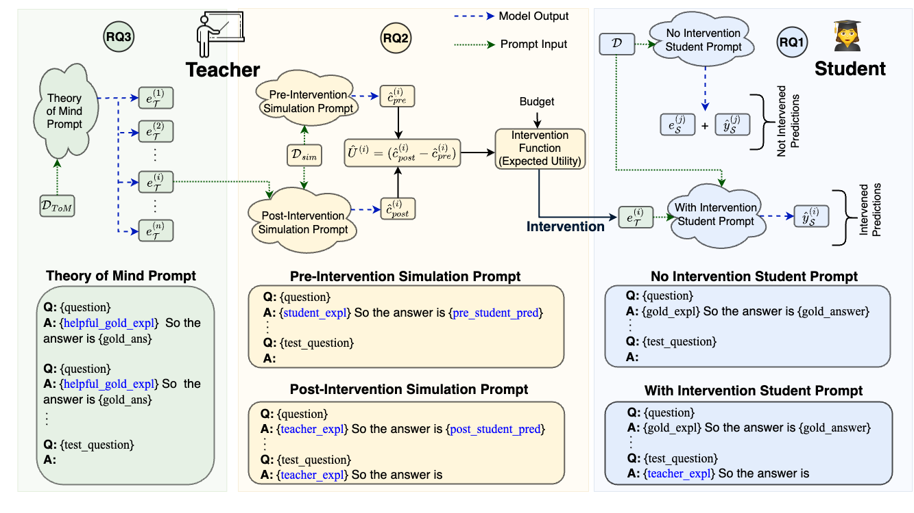
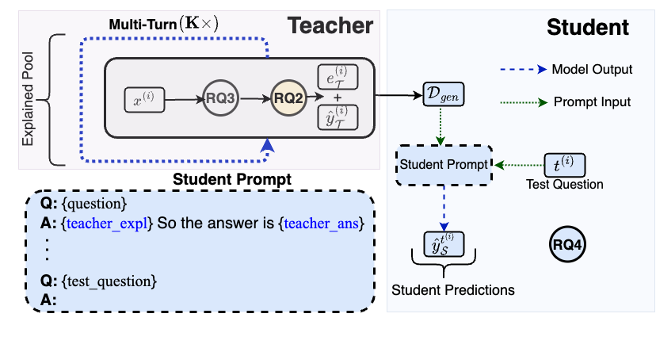

# ExplanationIntervention

[Can Language Models Teach? Teacher Explanations Improve Student Performance via Theory of Mind](https://arxiv.org/abs/2306.09299)

[Swarnadeep Saha](https://swarnahub.github.io/), [Peter Hase](https://peterbhase.github.io/), and [Mohit Bansal](https://www.cs.unc.edu/~mbansal/)

*Overview of single-round of interaction between a teacher LLM and a student LLM, covering first three research questions*


*Overview of multi-round student-teacher interaction, detailing the fourth research question*


## Installation
This repository is tested on Python 3.10.11.  
You should install this repository on a virtual environment. All dependencies can be installed as follows:
```
pip install -r requirements.txt
```

## Datasets
The datasets are already included in `datasets` folder.

## Research Question 1
In order to get results for RQ1, first update the `cache` directory where pre-trained models will be saved.
Then execute the following commands.
```
cd src
python main_single_turn.py --intervention_strategy random --results_file ../results/rq1.txt
```
This, by default will run experiments on the StrategyQA dataset with the Flan-T5 models. Update the model and dataset paths accordingly.

## Research Question 2
Execute the following commands.
```
cd src
python main_single_turn.py --intervention_strategy mm_both --results_file ../results/rq2.txt
```

## Research Question 3
Execute the following commands.
```
cd src
python main_single_turn.py --intervention_strategy mm_both --teacher_expl_type useful_teacher --results_file ../results/rq3.txt
```

## Research Question 4
Execute the following commands.
```
cd src
python main_multi_turn.py --results_file ../results/rq4.txt
```

## Research Question 5
Execute the following commands.
```
cd src
python main_single_turn.py --deceive True --results_file ../results/rq5.txt
```

The harmful/deceiving explanations we constructed (two per sample) are placed in `datasets/strategyqa_dataset/harmful_explanations.json`.

### Citation
```
@article{saha2023teach,
  title={Can Language Models Teach? Teacher Explanations Improve Student Performance via Theory of Mind},
  author={Saha, Swarnadeep and and Hase, Peter and Bansal, Mohit},
  journal={arXiv preprint arXiv:2306.09299},
  year={2023}
}
```
